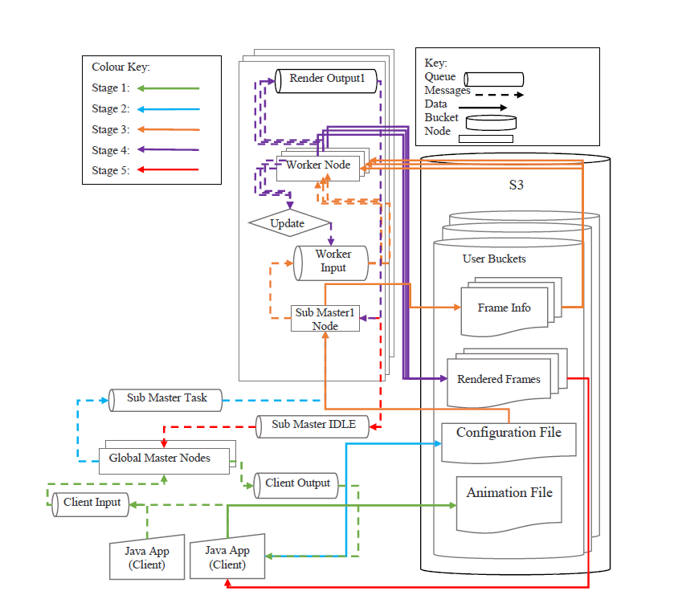
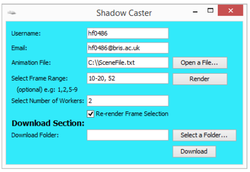

# Shadow Caster
A cloud based ray-tracer

Our rendering service aims to provide customisation and scalability to amateur and small business users,
drastically improving render times without having to purchase, maintain or create their own render farms. Rendering time is reduced by distributing animations, or frames, across many EC2 nodes.

**Cloud Provider**

Shadow Caster is built using Amazon Web Services: 
* **EC2:**
  *  Use Micro EC2 instances as the compute resource that comes with AWS Free Tier. 
  *  Micro instances work well with our platform because Shadow Caster is embarrassingly parallel, the compute power can be distributed across single core instances and perform efficiently.
* **Elastic Beanstalk:** Automatically scales Global Master node.
* **SQS:** For communication between EC2 instances, services and clients Amazon, ensures that the animation process is stable, reliable and robust.
* **SNS:** For notifications, gives the ability to inform the user that their render is complete via emai
* **Cloud Watch:** Monitors our service and gives us access to metrics and statistics of our ec2 nodes, queues and topics

**Ray-Tracer**

Shadow Caster currently renderers frames using a basic Python ray tracer. Available at https://github.com/prw/raytracer. 

**Shadow Caster System**

Shadow Caster comprises of:

* Backend
* Client Application
    
Backend

Shadow Caster follows a three stage hierarchy, a Global Master, Sub Master, and Worker nodes. 
This structure ensures each animation is handled independently and that each user is able to gain full usage, does not need to waitfor other users and is ever slowed down by heavy workload on the server end.
It means that each user can treat the system as their own, with their own dedicated Sub Master and renderers.

Backend Process Flow Diagram

Performance results of a worker with different node types and counts.

[PerformanceAnim.txt](./test/PerformanceAnim.txt) is the animation file used to test performance.

Client Application

Client application was developed using the Java SDK and AWS toolkit for Eclipse ID, and provides all of the necessary options for the user to customise and setup their animation for render. 
The application uploads and downloads files from S3, and send messages to GM node using SQS.
